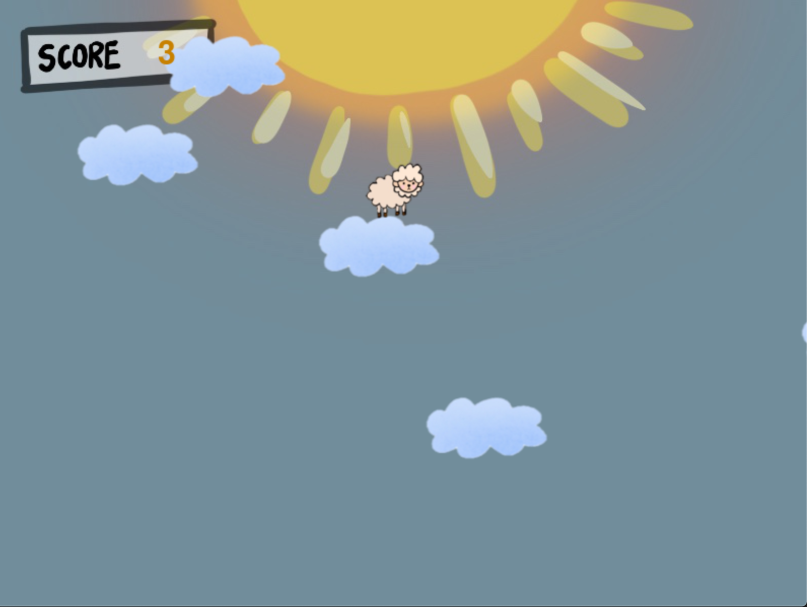

# Reaching-Under-Sky

## Game Overview

#### Number of Player: 1
#### Game Overview :
- Reaching-Under-Sky is a 2d game which player willl start of in the very top of the sky and standing on a cloud, player need to keep
jumping down to lower cloud to avoid being overheat by the sun. The player screen will slowly move up which makes the player closer and closer to the sun, which is place at the top of the screen. As the time goes on, the speed of the screen scrolling down will become faster therefore make it more difficult towrds the end.
#### Game Goal: 
- The goal is to fall from clouds to clouds in order to stay away from the sun, but if player fail to land on cloud, player will fall off the sky and game will ends. Also if player touches the sun, game will ends too. The longer the player can survive on a cloud, the more points the player will get.
#### Game Control:
- There are two controls, which is left and right, player will use these to control the direction they want to go.

#### Preview of Game Screen
  
