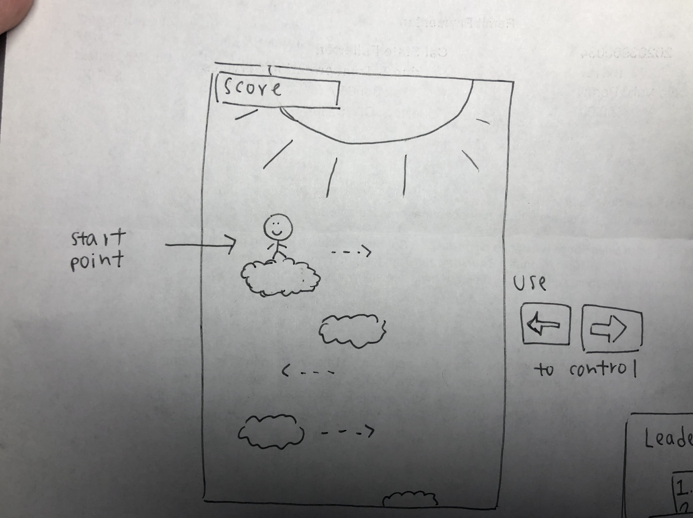
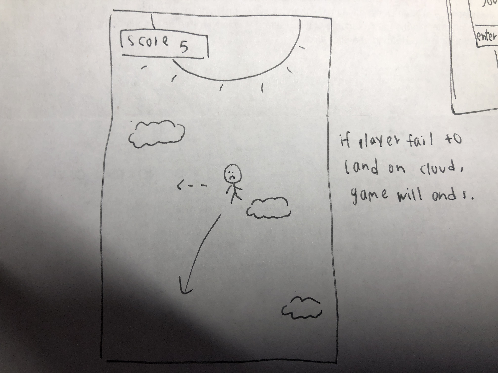
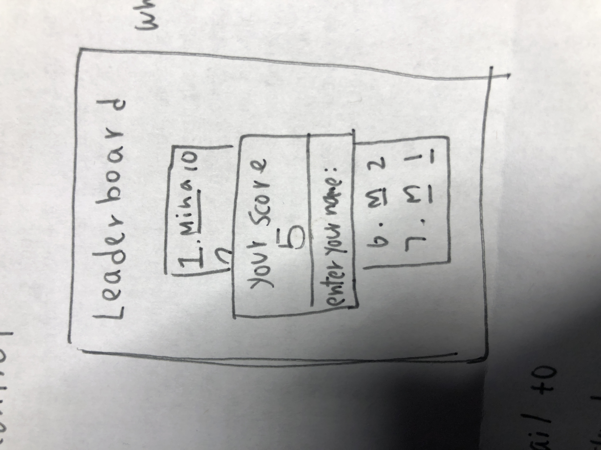

# Design of Sky-Top
## Game Overview
#### Game Made :
- this is a game made with python pygame
- will be creating player's character and background later in detail using procreate.
- will be using some relax background music, and dying sound effect.
#### Number of Player: 1
#### Game Overview :
- Sky-Top is a 2d game which player willl start of in the very top of the sky and standing on a cloud, player need to keep
jumping down to lower cloud to avoid being overheat by the sun. The player screen will slowly move up which makes the player closer and closer to the sun, which is place at the top of the screen. 
#### Game Goal: 
- The goal is to fall from clouds to clouds in order to stay away from the sun, but if player fail to land on cloud, player will fall off the sky and game will ends. Also if player touches the sun, game will ends too. Every cloud player jump onto, will score 1 point. Every player's score will be written on leaderboard. 
#### Game Control:
- There are two controls, which is left and right, player will use these to control the direction they want to go.

## sketch of game on paper
- player will start standing on a cloud, and will use left and right on keyboard to control.
  

- if player fail to land on a cloud when jumping down, game will ends.

- when game ends, screen will switch to leader board page, which will prompt player to enter thier name and place thier name and score on the leader board.

